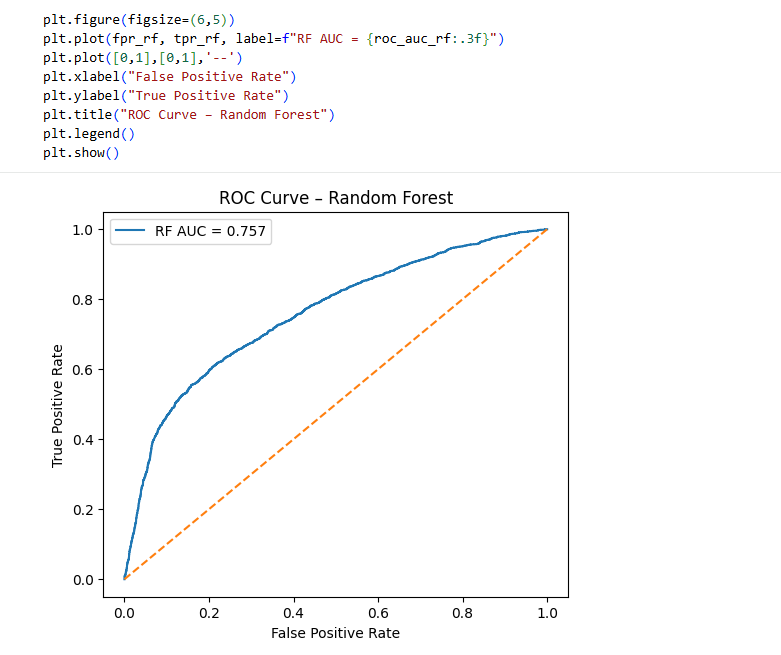
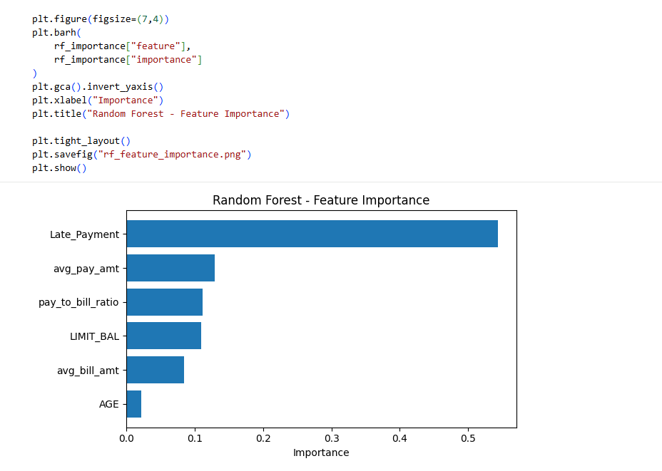
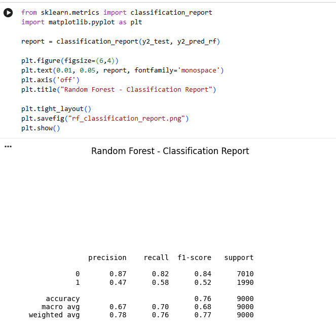

# 📊 Credit Risk – Default Prediction

This project builds a complete end-to-end **credit default prediction pipeline** using behavioural and financial features.  
The goal is to predict whether a customer will default on the next month’s credit card payment.

---

## 📌 Problem Statement

Predict whether a customer will default on the next month’s payment using customer profile and behavioural data.

This is a typical real-world banking use-case used for:

- early risk identification  
- portfolio monitoring  
- credit decision support  

---

## 📁 Dataset

**Source** – UCI Credit Card Default Dataset  
**Rows** – 30,000 customers  

Target variable used in the project:

```
is_default
```

(original column: `default.payment.next.month`)

---

## 🗂 Repository Structure

```
credit-risk-default-prediction/
│
├── data/
│   └── UCI_Credit_Card.csv
│
├── notebooks/
│   └── credit_risk_project.ipynb
│
├── images/
│   ├── logistic_roc_curve.png
│   ├── rf_roc_curve.png
│   ├── rf_feature_importance.png
│   ├── rf_classification_report.png
│
└── README.md
```

---

# 🧠 Project Workflow

---

## 1. Excel based business exploration

Initial analysis was done in Excel using pivot tables.

We analysed:

- Late payment vs default
- Payment behaviour buckets (Low / Medium / High)
- Overall default distribution

### Key observations from Excel

- Customers with **low payment behaviour** have the highest default rate.
- Customers with **late payments** are more likely to default.
- The dataset is **imbalanced** (non-defaulters are much more than defaulters).

These insights guided feature engineering.

---

## 2. Feature engineering

Behavioural features created:

| Feature | Description |
|------|-----------|
| avg_bill_amt | Average of bill amounts |
| avg_pay_amt | Average of payment amounts |
| pay_to_bill_ratio | avg_pay_amt / avg_bill_amt |
| Late_Payment | Whether the customer had late payment behaviour |

Target:

```
is_default
```

---

## 3. SQL analysis inside Python

We created a SQL table in Python and validated patterns using SQL queries.

Example:

```sql
SELECT
    Late_Payment,
    AVG(is_default) AS default_rate,
    COUNT(*) AS customers
FROM credit_card_customers
GROUP BY Late_Payment;
```

This confirmed:

Late payment behaviour is strongly linked to default risk.

---

## 4. Final modelling dataset

Features used for modelling:

- LIMIT_BAL
- AGE
- Late_Payment
- avg_bill_amt
- avg_pay_amt
- pay_to_bill_ratio

Target:

```
is_default
```

---

## 5. Train – Test split

```
70% training
30% testing
```

---

# 🤖 Models Implemented

---

## Model 1 – Logistic Regression (baseline)

### Why

- industry standard baseline
- easy to interpret
- fast to train

### Results

- Accuracy ≈ 0.79
- ROC-AUC ≈ 0.725

The model predicts non-defaulters very well but misses many real defaulters.

### ROC curve


---

## Model 2 – Logistic Regression with threshold tuning

We changed the probability cutoff from 0.50 to 0.30.

### Why

In banking, missing a defaulter is more costly than wrongly flagging a good customer.

### Effect

- Recall for defaulters increased
- Precision decreased
- More risky customers are detected

This shows how business objectives affect model usage.

---

## Model 3 – Logistic Regression with class weighting

We trained:

```
class_weight = "balanced"
```

### Why

The dataset is imbalanced.

### Effect

- Better recall for defaulters
- Slightly lower accuracy
- More suitable for risk-focused use cases

---

## Model 4 – Random Forest

### Why

- captures non-linear relationships
- automatically learns feature interactions
- very strong for tabular data

### Results

- Accuracy ≈ 0.76
- ROC-AUC ≈ 0.757
- Better default detection than baseline logistic regression

### ROC curve



---

### Feature importance – Random Forest



Most important features:

- Late_Payment
- avg_pay_amt
- pay_to_bill_ratio
- LIMIT_BAL

This matches business logic.

---

### Classification report – Random Forest



---

## Model 5 – Gradient Boosting

### Why

- strong tree-based ensemble model
- focuses on correcting previous mistakes
- often outperforms single tree models

### Results

- Accuracy ≈ 0.81
- ROC-AUC ≈ 0.757
- Higher precision for defaulters
- Lower recall compared to Random Forest

This model is more conservative when predicting defaults.

---

# 📊 Model Comparison Summary

| Model | Accuracy | AUC | Default Recall (Class 1) | Main Strength |
|-----|-------|------|--------------------------|--------------|
| Logistic Regression | ~0.79 | ~0.725 | Low | Simple and interpretable |
| Logistic + threshold | ~0.78 | ~0.725 | Higher | Better risk capture |
| Logistic + class weight | ~0.78 | ~0.733 | Higher | Handles imbalance |
| Random Forest | ~0.76 | ~0.757 | Higher | Captures non-linear behaviour |
| Gradient Boosting | ~0.81 | ~0.757 | Moderate | Best overall accuracy |

---

# 📌 Key business findings

- Late payment behaviour is the strongest risk indicator.
- Payment-to-bill behaviour is a very important signal.
- Logistic regression is useful for explainability.
- Tree-based models capture behavioural complexity much better.
- Threshold tuning significantly changes business outcomes.

---

# 📌 Final conclusion

This project demonstrates a complete real-world credit risk workflow:

- Excel-based business understanding
- Feature engineering
- SQL validation
- Multiple machine learning models
- Business-oriented evaluation

Random Forest and Gradient Boosting provide better performance, while Logistic Regression remains valuable for explainability and benchmarking.

---

# 🛠 Tools used

- Python (Pandas, NumPy)
- SQL (SQLite via pandas)
- Scikit-learn
- Matplotlib
- Excel (pivot tables)
- Google Colab
- GitHub

---

# 🚀 Future improvements

- Hyper-parameter tuning
- Cross-validation
- SHAP-based explainability
- Cost-sensitive optimisation
- Model deployment as a scoring API

